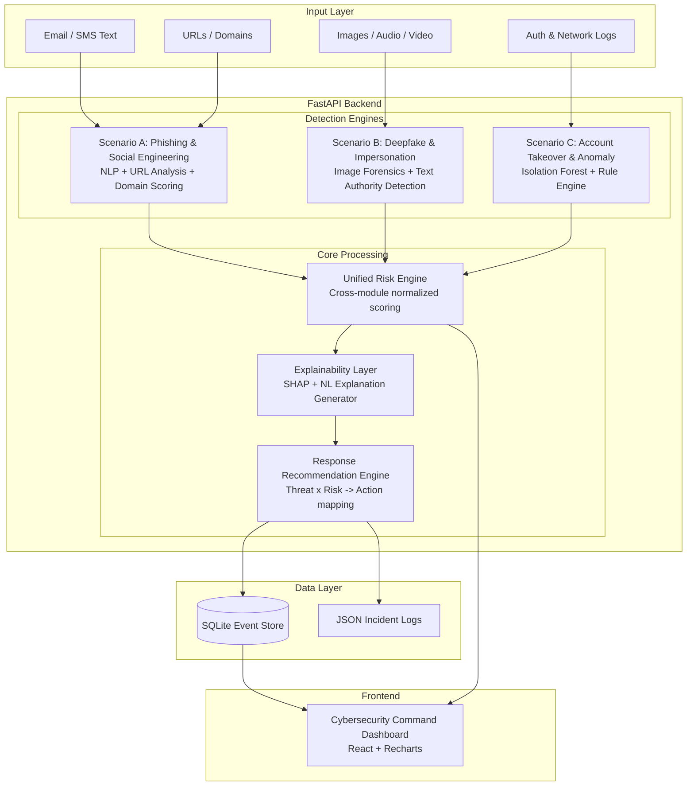

# CYBERGUARD — Project Plan

## 1. Problem Restatement

Organizations face an escalating wave of cyber threats spanning both the **technology layer** (malware, credential theft, account takeover, network anomalies, API abuse) and the **human layer** (AI-crafted phishing, deepfakes, voice cloning, social-engineering impersonation). Traditional rule-based security tools cannot keep pace with AI-generated attacks. CYBERGUARD is an **AI-Powered Cyber Threat, Phishing & Digital Impersonation Detection and Response System** that analyses multi-source digital activity, classifies threats, assigns risk scores, provides **human-readable explanations with supporting evidence**, and recommends concrete response actions — all surfaced through an interactive Cybersecurity Command Dashboard.

---

## 2. System Architecture

### 2.1 High-Level Data Flow

```
Input Sources                Detection Engines              Risk & Explanation            Response & Dashboard
┌──────────────┐      ┌────────────────────────┐      ┌──────────────────────┐      ┌─────────────────────┐
│ Emails/SMS   │─────▶│ Phishing Detection     │─────▶│                      │      │                     │
│ URLs/Domains │─────▶│   Module (Scenario A)  │      │  Unified Risk Engine │      │ Response            │
├──────────────┤      ├────────────────────────┤      │  ┌────────────────┐  │─────▶│ Recommendation      │
│ Images/Audio │─────▶│ Deepfake/Impersonation │─────▶│  │ Cross-module   │  │      │ Engine              │
│ Video/Text   │─────▶│   Module (Scenario B)  │      │  │ risk scoring   │  │      │ ┌─────────────────┐ │
├──────────────┤      ├────────────────────────┤      │  │ + Explainability│  │      │ │ Action Simulator│ │
│ Auth Logs    │─────▶│ Account Takeover /     │─────▶│  │ Layer (SHAP +  │  │      │ └─────────────────┘ │
│ Network Logs │─────▶│   Anomaly Detection    │      │  │ NL generation) │  │      └──────────┬──────────┘
│ API Logs     │      │   Module (Scenario C)  │      │  └────────────────┘  │                 │
└──────────────┘      └────────────────────────┘      └──────────────────────┘                 │
                                                                                               ▼
                                                                                  ┌─────────────────────┐
                                                                                  │ Cybersecurity       │
                                                                                  │ Command Dashboard   │
                                                                                  │ (React + Charts)    │
                                                                                  └─────────────────────┘
```

### 2.2 Architecture Diagram (Mermaid)



---

## 3. Module-by-Module Breakdown

### 3.1 Scenario A — Phishing / Social Engineering Detection

| Sub-component | Description |
|---|---|
| **Text Feature Extraction** | Urgency-word scoring (spaCy), credential-request phrase detection, authority-impersonation markers |
| **URL/Domain Analysis** | Levenshtein distance against known-good domains, WHOIS age check, SSL certificate inspection, redirect-chain analysis |
| **Phishing Classifier** | TF-IDF + XGBoost on public phishing email corpus |
| **Risk Scorer** | Weighted combination of text signals + URL signals -> Safe/Low/Medium/High/Critical |
| **Explanation Generator** | Template-based + LLM-enhanced NL rationale citing specific indicators |

### 3.2 Scenario B — Deepfake / Digital Impersonation Detection

| Sub-component | Description |
|---|---|
| **Image Forensics** | Error Level Analysis (ELA) via OpenCV + frequency-domain artifact detection (DCT spectral analysis) |
| **Face Manipulation Detection** | Lightweight CNN classifier on face-crop patches for warping/blending artifacts |
| **Text Impersonation Detection** | Authority-figure impersonation heuristics (title spoofing, org-name similarity, metadata anomalies) |
| **Confidence Scorer** | Authenticity probability + manipulation-indicator list |
| **Explanation Generator** | Lists specific artifacts found (e.g., "compression inconsistency in facial region," "ELA shows re-saved areas around eyes") |

### 3.3 Scenario C — Account Takeover / Technical Threat Detection

| Sub-component | Description |
|---|---|
| **Synthetic Log Generator** | Generates realistic auth logs with injected anomalies (impossible travel, brute force, new-device logins) |
| **Anomaly Detection Model** | Isolation Forest + rule-based hybrid (failed-login burst detection, geo-velocity checks, device fingerprint novelty) |
| **MITRE ATT&CK Mapper** | Maps detected anomaly patterns to ATT&CK technique IDs (T1110 Brute Force, T1078 Valid Accounts, etc.) |
| **Risk Scorer** | Per-event and per-session aggregate risk score |
| **Explanation Generator** | "3 failed logins from IP 203.0.113.42 in 2 minutes, followed by successful login from new device in a different country (impossible travel: Mumbai->London in 4 minutes)" |

### 3.4 Cross-Cutting: Unified Risk Engine (Phase 5)

- Normalizes per-module risk scores to a common 0-100 scale
- Applies time-decay weighting (recent events weighted more)
- Produces per-user / per-session aggregate risk level
- Outputs the unified `ThreatEvent` schema consumed by the dashboard

### 3.5 Cross-Cutting: Response Recommendation Engine (Phase 6)

- Rule-based mapping: `(threat_type, risk_level) -> [recommended_actions]`
- Action vocabulary: Block URL, Quarantine Email, Warn User, Require MFA, Revoke Session, Block IP/Device, Flag for Manual Review, Report Impersonation, Notify Admin/SOC, Escalate Incident
- Logs simulated "actions taken" for playbook-simulator add-on

### 3.6 Cybersecurity Command Dashboard (Phase 7)

- **Metrics cards**: Total events, threats detected, by category, by risk level
- **Attack timeline**: Time-series chart of threat events
- **Category breakdown**: Pie/donut chart (phishing, impersonation, deepfake, ATO)
- **Risk distribution**: Stacked bar chart by risk level
- **Most-targeted users/services**: Ranked list
- **Recommended actions feed**: Live action log with status
- **Incident tracker**: Table with filter/sort (status: open/investigating/resolved)
- **Threat detail modal**: Full explanation + evidence + recommended response per event

---

## 4. Data/Model Choices Per Module

| Module | Model/Technique | Justification |
|---|---|---|
| Phishing text classification | **TF-IDF + XGBoost** (primary), with keyword/regex feature augmentation | Fast to train, excellent on tabular features; avoids large model download constraints at hackathon |
| Phishing NLP features | **spaCy (en_core_web_sm)** | Lightweight, fast entity/token extraction for urgency cues and entity matching |
| URL/domain scoring | **Levenshtein distance + python-whois + ssl module** | Deterministic, explainable domain-similarity scoring; no model needed |
| Image deepfake detection | **Error Level Analysis (OpenCV)** + **Frequency-domain DCT analysis** | Classical forensic techniques that work on single images without GPU; visually compelling output |
| Face manipulation detection | **Lightweight CNN** (pretrained or simple architecture on FaceForensics++ subset) | If pretrained weights available; otherwise fall back to ELA-only with honest accuracy reporting |
| Text impersonation detection | **Rule-based + NLP heuristics** (title matching, org-name Levenshtein, metadata flags) | Deterministic and explainable; impersonation signals are often structural rather than statistical |
| Login anomaly detection | **Isolation Forest (scikit-learn)** + rule engine | Isolation Forest is unsupervised (no labels needed for synthetic logs); rules catch obvious patterns (geo-velocity, brute force) |
| Explainability | **SHAP (TreeExplainer)** for XGBoost models; **template + rule-based NL generation** for all modules | SHAP provides feature-level attribution; templates ensure readable, consistent explanations |
| Cross-module risk scoring | **Weighted linear combination** with configurable thresholds | Simple, transparent, auditable — judges can understand the math |

---

## 5. Folder / Repository Structure

```
d:\BPUT Project\
├── PROJECT_PLAN.md                    # This file
├── SUBMISSION.md                      # Final hackathon documentation (Phase 10)
├── README.md                          # Quick-start guide
│
├── backend/                           # Python FastAPI backend
│   ├── requirements.txt
│   ├── main.py                        # FastAPI app entry point
│   ├── config.py                      # App configuration
│   ├── database.py                    # SQLite setup & models
│   │
│   ├── models/                        # Shared data models / schemas
│   │   ├── __init__.py
│   │   ├── schemas.py                 # Pydantic models (ThreatEvent, RiskLevel enum, etc.)
│   │   └── enums.py                   # RiskLevel, ThreatCategory, ActionType enums
│   │
│   ├── modules/                       # Detection modules (one per scenario)
│   │   ├── __init__.py
│   │   ├── phishing/                  # Scenario A
│   │   │   ├── __init__.py
│   │   │   ├── detector.py            # Main detection orchestrator
│   │   │   ├── text_analyzer.py       # NLP feature extraction
│   │   │   ├── url_analyzer.py        # URL/domain analysis
│   │   │   ├── classifier.py          # ML classifier
│   │   │   └── explainer.py           # Explanation generator
│   │   │
│   │   ├── deepfake/                  # Scenario B
│   │   │   ├── __init__.py
│   │   │   ├── detector.py
│   │   │   ├── image_forensics.py     # ELA + frequency analysis
│   │   │   ├── impersonation.py       # Text-based impersonation detection
│   │   │   └── explainer.py
│   │   │
│   │   └── account_takeover/          # Scenario C
│   │       ├── __init__.py
│   │       ├── detector.py
│   │       ├── log_generator.py       # Synthetic log generator
│   │       ├── anomaly_model.py       # Isolation Forest + rules
│   │       ├── mitre_mapper.py        # ATT&CK technique mapping
│   │       └── explainer.py
│   │
│   ├── engine/                        # Cross-cutting engines
│   │   ├── __init__.py
│   │   ├── risk_engine.py             # Unified risk scoring
│   │   ├── explanation_engine.py      # Unified explanation formatting
│   │   └── response_engine.py         # Response recommendation
│   │
│   ├── api/                           # FastAPI route handlers
│   │   ├── __init__.py
│   │   ├── phishing.py                # /api/analyze/phishing
│   │   ├── deepfake.py                # /api/analyze/deepfake
│   │   ├── account.py                 # /api/analyze/account
│   │   ├── dashboard.py               # /api/dashboard/*
│   │   └── events.py                  # /api/events/*
│   │
│   ├── data/                          # Sample/test data
│   │   ├── phishing_samples.json
│   │   ├── legitimate_samples.json
│   │   ├── test_images/
│   │   └── synthetic_logs/
│   │
│   └── tests/                         # Unit & integration tests
│       ├── test_phishing.py
│       ├── test_deepfake.py
│       ├── test_account.py
│       └── test_risk_engine.py
│
├── frontend/                          # React dashboard
│   ├── package.json
│   ├── vite.config.js
│   ├── index.html
│   ├── public/
│   └── src/
│       ├── main.jsx
│       ├── App.jsx
│       ├── App.css
│       ├── index.css                  # Design system
│       ├── api/
│       │   └── client.js              # API client
│       ├── components/
│       │   ├── Dashboard.jsx
│       │   ├── MetricsCards.jsx
│       │   ├── ThreatTimeline.jsx
│       │   ├── CategoryBreakdown.jsx
│       │   ├── RiskDistribution.jsx
│       │   ├── ThreatDetail.jsx
│       │   ├── ActionsFeed.jsx
│       │   ├── IncidentTracker.jsx
│       │   ├── PhishingAnalyzer.jsx
│       │   ├── DeepfakeAnalyzer.jsx
│       │   └── AccountAnalyzer.jsx
│       └── utils/
│           └── formatters.js
│
└── docs/                              # Additional documentation
    ├── architecture.md
    └── evaluation_results.md
```

---

## 6. Build Phases (Checklist)

- [x] **Phase 1 — Foundations & Repo Scaffolding**
  - Set up repo structure, `requirements.txt`, `package.json`
  - Base FastAPI app skeleton with CORS, health endpoint
  - Base React app (Vite) with placeholder dashboard
  - Shared data models: `ThreatEvent` schema, `RiskLevel` enum
  - End-to-end verification: API call from React -> FastAPI -> response renders
  - **Deliverable:** App boots, "hello world" round-trip works (Verified on http://127.0.0.1:5173 and http://127.0.0.1:8000)

- [x] **Phase 2 — Scenario A: Phishing/Social-Engineering Detection**
  - Text ingestion pipeline + feature extraction (urgency, credential-request, authority cues)
  - URL/domain analysis (Levenshtein similarity, WHOIS mock, SSL inspection, redirect detection)
  - TF-IDF + ML classifier trained on labeled phishing & legitimate corpus
  - Risk scorer: feature-weighted -> RiskLevel mapping (Safe, Low, Medium, High, Critical)
  - Natural-language explanation generator with evidence-driven reasoning
  - Test against labeled sample set; report precision/recall/F1 (100% Accuracy, 1.00 Precision/Recall/F1 verified)
  - **Deliverable:** `/api/analyze/phishing` endpoint fully functional & interactive Phishing Analyzer UI live on dashboard

- [x] **Phase 3 — Scenario B: Impersonation/Deepfake Detection**
  - Image upload + preprocessing pipeline
  - Error Level Analysis (ELA) implementation
  - Frequency-domain (DCT) artifact detection
  - Text-based impersonation-of-authority detection
  - Authenticity/confidence score + manipulation indicators
  - Test on sample images; report results with known limitations
  - **Deliverable:** `/api/analyze/deepfake` and `/api/analyze/impersonation` endpoints + DeepfakeAnalyzer UI live on dashboard

- [x] **Phase 4 — Scenario C: Account Takeover / Anomaly Detection**
  - Synthetic auth-log generator (normal + anomalous patterns)
  - Isolation Forest model + rule-based hybrid detector
  - Impossible-travel (Haversine geo-velocity), brute-force, new-device detection
  - MITRE ATT&CK technique mapping (T1110, T1078, T1586.002, T1539)
  - Risk score + explanation per event
  - **Deliverable:** `/api/analyze/account` endpoint + synthetic log generator + AccountAnalyzer UI live on dashboard

- [ ] **Phase 5 — Unified Risk Engine + Explainability Layer**
  - Common `ThreatEvent` schema normalization across all modules
  - Cross-module 0-100 risk scoring with configurable weights
  - Per-user / per-session aggregate scoring
  - Standardized explanation format (all modules -> same JSON structure)
  - SHAP integration for XGBoost-based models
  - **Deliverable:** `/api/events` returns unified, scored, explained events

- [ ] **Phase 6 — Response Recommendation Engine**
  - `(threat_type, risk_level) -> [actions]` mapping table
  - Action types: Block URL, Quarantine, Warn, MFA, Revoke, Block IP, Flag, Report, Notify, Escalate
  - Simulated action-execution logger (playbook simulator)
  - **Deliverable:** Every threat event includes recommended + simulated actions

- [ ] **Phase 7 — Cybersecurity Command Dashboard**
  - Metrics cards (total events, threats, by category, by risk)
  - Attack timeline (Recharts time-series)
  - Category breakdown (pie/donut)
  - Risk distribution (stacked bar)
  - Most-targeted users/services list
  - Recommended actions feed
  - Incident status tracker (table with filters)
  - Threat detail modal (full explanation + evidence)
  - Individual analyzer pages (phishing, deepfake, account)
  - **Deliverable:** Full interactive dashboard wired to live backend data

- [ ] **Phase 8 — Add-On Features** (priority order)
  1. Explainable AI layer (SHAP visualizations + LLM-style rationale)
  2. Unified cross-module risk aggregation (already in Phase 5, polish here)
  3. MITRE ATT&CK technique mapping display on dashboard
  4. Graph-based attack correlation (NetworkX user-IP-device-domain graph)
  5. LLM-assisted synthetic phishing generation for testing
  6. Automated incident-response playbook simulator (expanded)
  7. Audio/voice-cloning spectrogram visualizer (if time)
  8. Privacy-preserving architecture documentation (federated learning note)

- [ ] **Phase 9 — Evaluation & Performance**
  - Precision/Recall/F1 per module on held-out test data
  - Latency measurement per detection endpoint
  - Scalability write-up (containerization, horizontal scaling, queue-based ingestion)

- [ ] **Phase 10 — Final Documentation (SUBMISSION.md)**
  - All 13 deliverable sections per Section 7 of the prompt
  - Screenshots embedded
  - Architecture diagrams
  - Honest limitations + future roadmap

---

## 7. Simulated vs. Real — Judge Transparency Matrix

| Component | Status | Details |
|---|---|---|
| **Phishing email/SMS content** | **Synthetic + Public Dataset** | Combination of hand-crafted test samples and selections from public phishing corpora (e.g., Nazario phishing corpus, public Kaggle datasets) |
| **URL/Domain analysis** | **Real techniques, test data** | Levenshtein scoring and SSL checks are real algorithms; tested against synthetic look-alike domains, not live malicious URLs |
| **WHOIS lookups** | **Simulated** | Mock WHOIS responses to avoid rate limits and network dependency during demo |
| **Deepfake images** | **Public benchmark + synthetic** | Test images from FaceForensics++ public subset or manually edited images with documented manipulations |
| **Audio deepfakes** | **Stretch goal / simulated** | If implemented, uses public ASVspoof dataset samples; otherwise documented as future capability |
| **Authentication logs** | **Fully synthetic** | Generated by our synthetic log generator with configurable anomaly injection — not from real systems |
| **Network traffic logs** | **Fully synthetic** | Simulated log patterns; no live packet capture |
| **Response actions** | **Simulated** | "Block URL," "Quarantine Email," etc. are logged to the incident database but do not execute against real infrastructure |
| **MITRE ATT&CK mapping** | **Real framework, heuristic mapping** | Uses official ATT&CK technique IDs; mapping is rule-based, not trained on real incident data |
| **Dashboard data** | **Live from detection engines** | Dashboard reads from SQLite populated by actual detection pipeline runs — not static mock data |

---

## 8. Risks & Limitations Accepted

| Risk | Mitigation |
|---|---|
| **Deepfake detection accuracy on real-world data** | Using classical forensic techniques (ELA, DCT) which are well-understood but less accurate than SOTA deep models; will report honest accuracy numbers |
| **Phishing classifier may not generalize to novel AI-generated phishing** | Include rule-based features (urgency, domain similarity) as fallback alongside ML; document this limitation |
| **No real network/infrastructure integration** | All logs are synthetic; documented clearly. Architecture supports plug-in of real log sources |
| **Single-machine deployment** | Document containerization & scaling approach for production; hackathon demo runs on localhost |
| **Python 3.14 compatibility** | Some ML libraries may have compatibility issues; will pin compatible versions and document workarounds |
| **No GPU available** | All models chosen to run on CPU; no large transformer fine-tuning attempted |
| **WHOIS/DNS rate limits** | Mock WHOIS data for demo; real lookups documented as production capability |

---

## 9. Environment & Dependencies (Preliminary)

### Backend (Python)
```
fastapi>=0.100.0
uvicorn>=0.23.0
pydantic>=2.0
scikit-learn>=1.3
xgboost>=2.0
numpy>=1.24
pandas>=1.5
spacy>=3.6
opencv-python-headless>=4.8
Pillow>=10.0
python-multipart>=0.0.6
shap>=0.42
networkx>=3.1
aiofiles>=23.0
```

### Frontend (React + Vite)
```
react, react-dom
recharts (charting)
lucide-react (icons)
react-router-dom (routing)
```

---

## 10. Key Design Decisions

1. **XGBoost over DistilBERT for phishing**: Faster training, no GPU needed, SHAP integration is native. We augment with spaCy NLP features to compensate for the lack of contextual embeddings.

2. **ELA + DCT over deep CNN for deepfake**: No pretrained weights download uncertainty; classical techniques produce visually explainable outputs (ELA heatmaps, spectral plots) which are compelling for judges.

3. **SQLite over PostgreSQL**: Zero-configuration, single-file database is ideal for hackathon portability. Schema is designed to migrate to PostgreSQL trivially.

4. **Isolation Forest for anomaly detection**: Unsupervised — doesn't need labeled attack data, which we don't have. Combined with deterministic rules for known-pattern attacks (brute force, impossible travel).

5. **Template-based explanations over pure LLM generation**: Deterministic, reproducible, zero-latency explanations. Can demonstrate LLM-enhanced explanations as an add-on without being dependent on API availability.

6. **Monorepo with clean separation**: `backend/` and `frontend/` are independently deployable but co-located for hackathon convenience.
